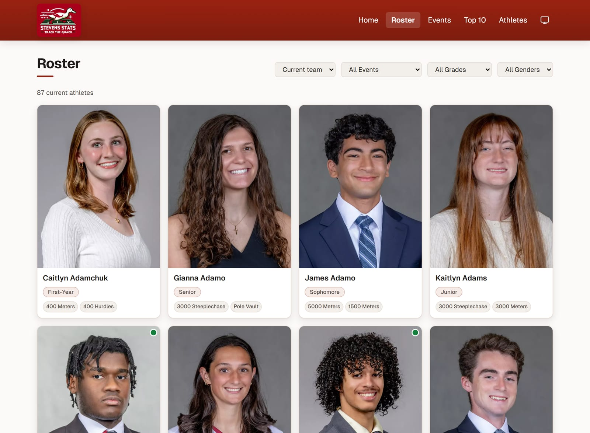
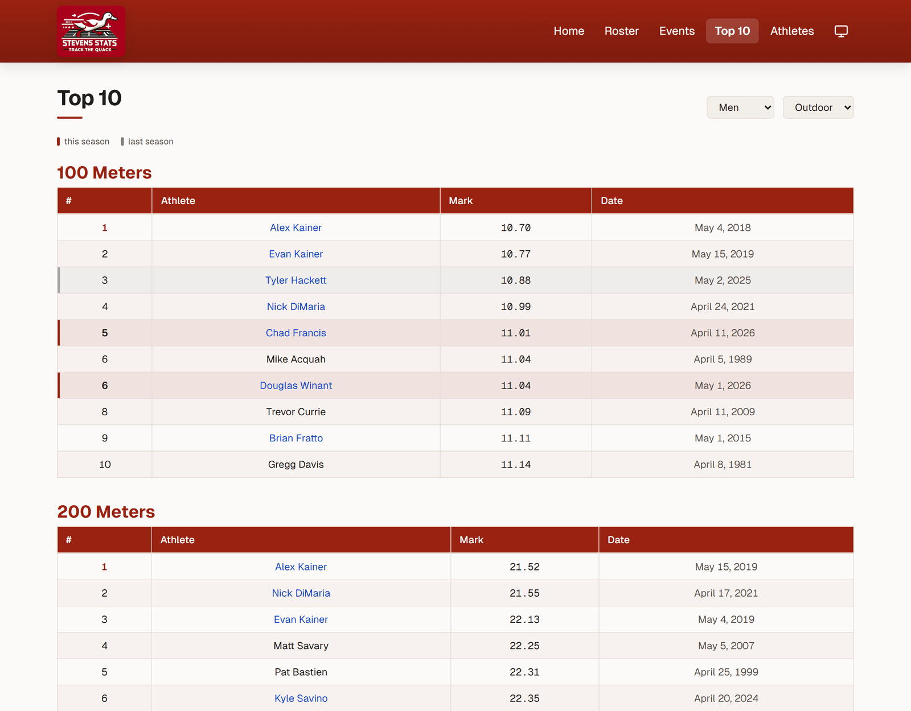

# Stevens Stats

A fast, static web app that tracks a college track & field team — rosters, career
bests, season-by-season progression, all-time top-ten lists, and conference
qualifying standards. Built with Next.js (App Router) and TypeScript.

**Live:** [stevens-stats.com](https://stevens-stats.com)

> Personal project, not affiliated with Stevens Institute of Technology. Results
> are scraped from [TFRRS](https://www.tfrrs.org) by [`scraper/`](scraper/README.md)
> into the JSON files in [`data/`](data/README.md), which the site imports at
> build time — no database, no server-side code at request time.

## Screenshots

> Real, publicly available team results (the same data shown on TFRRS and the
> official athletics site).

### Home — the "this week" feed


### Roster — filter by event, class year, or era



### Athlete profile — bests and time-scaled progression charts


### Events — per-event leaderboards with conference standards


### Top 10 — the all-time board



## Features

- **Home** — every current athlete's latest result, grouped by date, with
  personal-best / season-best / school-record badges and PB context.
- **Roster** — filterable grid (event, class year, gender, current vs. alumni),
  photos, event specialties, and a marker when the last result was a best.
- **Athlete profiles** — a player-card header (photo, class year or alumni
  status, headline event + PB + all-time rank); a stat-tile grid of bests per
  event, each with an inline sparkline; time-scaled progression charts (Recharts)
  that show *how long* each improvement took; roster-order prev/next nav; a share
  button; and a generated social-share card.
- **Events** — per-event season and all-time leaderboards, indoor and outdoor,
  with each athlete's all-time team rank and the MAC / AARTFC qualifying cut
  lines drawn on the list.
- **Top 10** — the all-time top-ten board for every event × gender × season,
  relays included; this-season and last-season rows highlighted; marks link to
  the TFRRS meet result, names to the profile.
- **Dark mode** — system-aware with a manual toggle; a warm-tinted palette in
  both themes, driven by CSS-variable design tokens.
- **Installable (PWA)** — add to home screen, works offline for pages you've
  opened, iOS safe-area aware.
- **SEO** — per-page metadata, `sitemap.xml`, `robots.txt`, and WebSite /
  SportsTeam / per-athlete `Person` structured data.
- **Static & fast** — every route (500+ athlete pages included) is prerendered at
  build; the dataset never ships to the browser.

## Tech stack

| Area | Choice |
| --- | --- |
| Framework | Next.js 15 (App Router, React 18, TypeScript), fully prerendered |
| Data | JSON in [`data/`](data/README.md), imported at build time via `lib/data.ts` |
| Ingestion | Python scraper ([`scraper/`](scraper/README.md)) — TFRRS → JSON |
| Styling | Tailwind CSS with CSS-variable design tokens (light / dark) |
| Type | Geist Sans + Geist Mono via `next/font` |
| Charts | Recharts |
| Images | Cloudinary (public URLs), keyed by TFRRS id |
| Hosting | Vercel, static ($0) |

## Architecture

```text
scraper/ (Python, TFRRS)  ──►  data/*.json  ──►  lib/data.ts  ──►  app/** (prerendered pages)
                               (in the repo)     (build time)

Athlete photos are served from Cloudinary via public image URLs.
```

- Every route is prerendered at build time. Pages are Server Components that read
  from `lib/data.ts`; the interactive parts (filters, sorting, the athlete
  picker, the charts) are small Client Components handed only the data they need.
- **No API routes and no database.** A "career best" is a `data/performances.json`
  row with an `is_*_best` flag, computed by the scraper. `prisma/schema.prisma`
  is kept as a data-model reference and the target for `scraper/load.py --push`
  if a live DB is ever wanted again.
- The old DB-backed API routes live in [`archive/`](archive/README.md), excluded
  from the build.

## Project structure

```text
app/
  athlete/        Athlete picker (page.tsx) + profile pages ([athleteId]/)
  roster/         Team roster
  events/         Event leaderboards & qualifying standards
  records/        All-time top-ten board
  home/           Results feed + news post detail
  opengraph-image.tsx   Site social card;  athlete/[athleteId]/ has a per-athlete one
  sitemap.ts / robots.ts
  layout.tsx      Root layout, metadata, structured data
components/        Navbar, bottom tabs, shared UI
lib/              data.ts (typed loaders/helpers), format.ts, site.ts, photo.ts
data/             The dataset (see data/README.md)
scraper/          Python data collection (see scraper/README.md)
prisma/           Data-model reference + optional --push target
archive/          Old DB-backed API routes, not built
public/           Favicons, PWA icons, README screenshots
```

## Getting started

### Prerequisites

- Node.js 20+
- Python 3.10+ (only to refresh the data)
- A Cloudinary account (for athlete images)

### Setup

```bash
npm install
cp .env.example .env          # set NEXT_PUBLIC_CLOUDINARY_CLOUD_NAME

# refresh the data (optional — data/*.json is committed)
pip install -r scraper/requirements.txt
npm run data

npm run dev                   # http://localhost:3000  (/ redirects to /home)
```

### Environment variables

| Variable | Purpose |
| --- | --- |
| `NEXT_PUBLIC_CLOUDINARY_CLOUD_NAME` | Cloudinary cloud name for building public image URLs. |
| `NEXT_PUBLIC_SITE_URL` | Optional. Overrides the canonical origin (defaults to `https://stevens-stats.com`). |

## Scripts

| Command | Description |
| --- | --- |
| `npm run dev` | Start the dev server |
| `npm run build` | Static production build |
| `npm run start` | Serve the build |
| `npm run lint` | Run ESLint |
| `npm run data` | Re-scrape TFRRS and regenerate `data/*.json` |

## Deployment

Deploys on Vercel as a fully static site — no server functions, no secrets in the
build beyond the Cloudinary name. To refresh: `npm run data`, commit the changed
`data/*.json`, push — the deploy rebuilds. Portable to any static host with
`output: 'export'` + `images.unoptimized` in `next.config.mjs`.

## Status

The visual/UX redesign (see [`docs/REDESIGN.md`](docs/REDESIGN.md)) is complete.
Recent work: full historical backfill of alumni and results, SEO, and a
client-bundle diet. Open items: repopulate `data/blog_posts.json`, a scheduled
scraper Action, replacing placeholder graphics ([`docs/BRAND_ASSETS.md`](docs/BRAND_ASSETS.md)).

## Author

Built by [Mick Barbi](https://github.com/MickBarbi).

## License

Released under the [MIT License](LICENSE).
