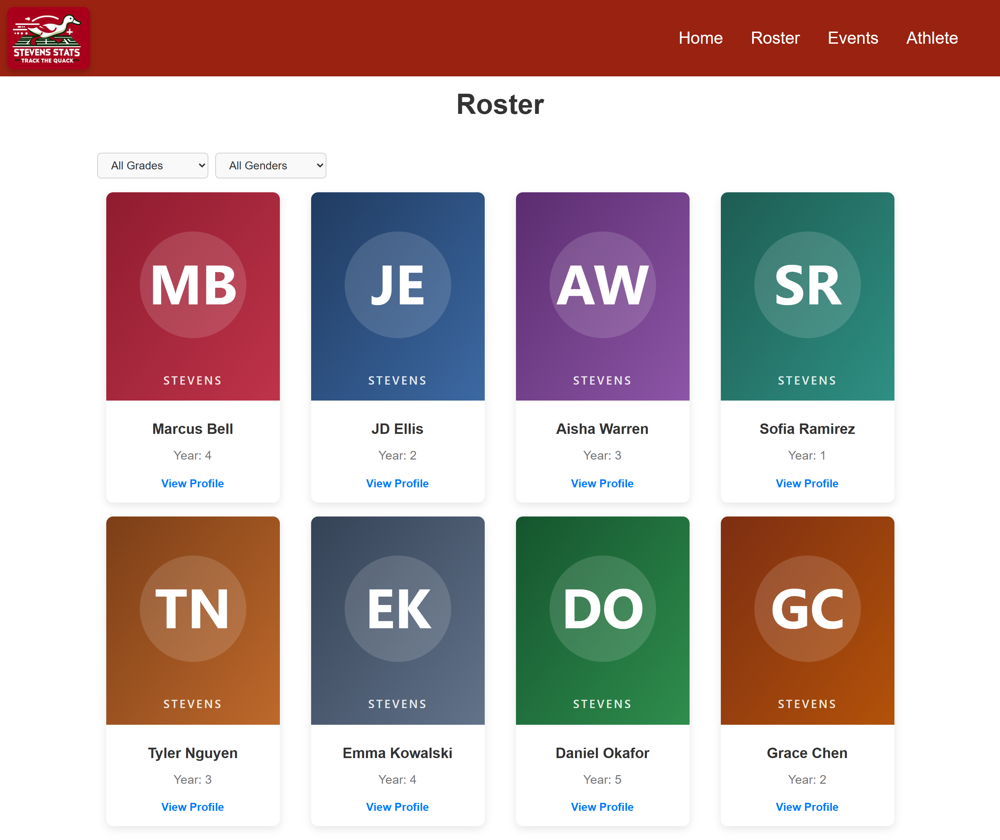
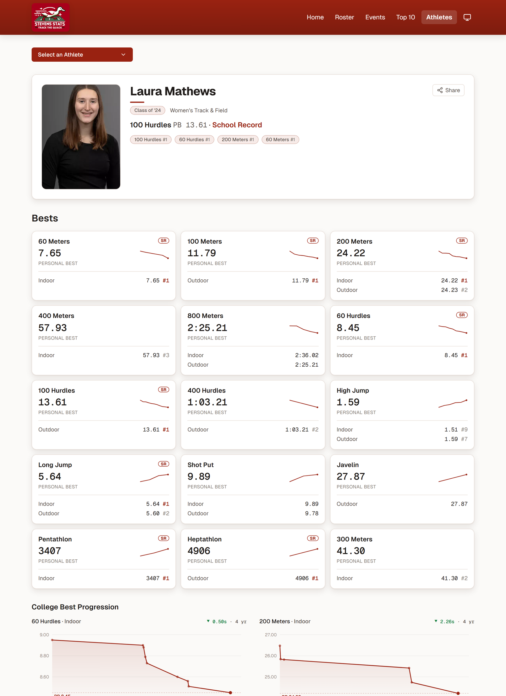
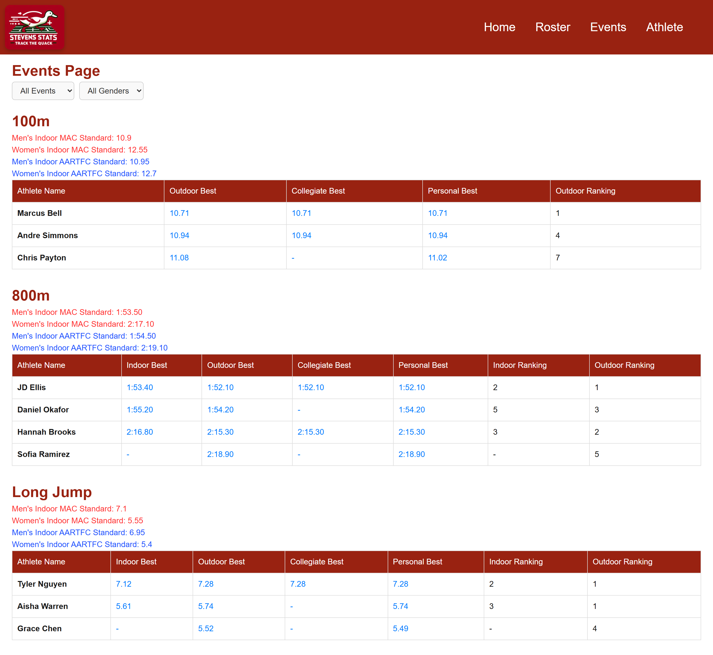
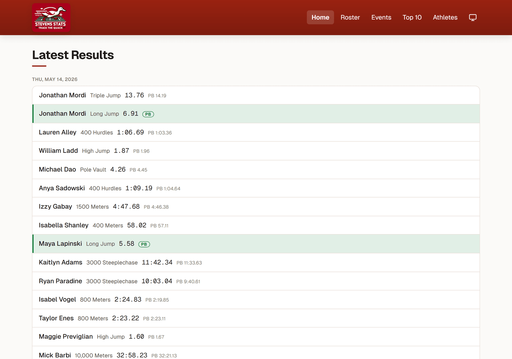

# Stevens Stats

A static web app for tracking and visualizing a college track & field team's statistics — athlete rosters, event bests, performance progressions, qualifying standards, and team news. Built with Next.js (App Router) and TypeScript.

> Personal project. The team's results are scraped from TFRRS by [`scraper/`](scraper/README.md) into the JSON files in [`data/`](data/README.md), which the site imports at build time — no database, no server-side code at request time.

## Screenshots

> The screenshots below are rendered with seeded demo data (invented athletes and results), not real athlete records.

**Team roster**



**Athlete profile — career bests and performance progression charts**



**Event leaderboards with conference qualifying standards**



**Home / team news**



## Features

- **Roster** — browse athletes with photos, class year, and event specialties.
- **Athlete profiles** — per-athlete page with career bests, awards, and a performance-progression chart (Recharts), plus a searchable athlete picker.
- **Events** — season bests by event alongside MAC / AARTFC qualifying standards.
- **Home / news** — team blog posts with individual post pages.
- **Responsive UI** — mobile navigation and layouts via Tailwind CSS.

## Tech stack

| Area     | Choice |
|----------|--------|
| Framework| Next.js 15 (App Router, React 18, TypeScript), statically prerendered |
| Data     | JSON files in [`data/`](data/README.md), imported at build time via `lib/data.ts` |
| Ingestion| Python scraper ([`scraper/`](scraper/README.md)) — TFRRS → JSON |
| Images   | Cloudinary (public URLs) |
| Charts   | Recharts |
| Styling  | Tailwind CSS with CSS-variable design tokens (light / dark) |

## Architecture

```
scraper/ (Python, TFRRS)  ──►  data/*.json  ──►  lib/data.ts  ──►  app/** (prerendered pages)
                                (in the repo)      (build time)

Athlete photos are served from Cloudinary via public image URLs.
```

- Every route is prerendered at build time. Pages are Server Components that read
  from `lib/data.ts`; the interactive bits (filters, sorting, the athlete picker,
  the charts) are small Client Components they hand data to.
- There are **no API routes and no database**. A "career best" is a
  `data/performances.json` row with an `is_*_best` flag set, computed by the
  scraper. `prisma/schema.prisma` is kept as the data-model reference and the
  target for `scraper/load.py --push` if a live DB is ever wanted again.
- The old DB-backed API routes live in [`archive/`](archive/README.md), excluded
  from the build.

## Project structure

```
app/
  athlete/        Athlete picker (page.tsx) + profile pages ([athleteId]/)
  roster/         Team roster
  events/         Event leaderboards & qualifying standards
  home/           News posts + post detail
  layout.tsx      Root layout + navbar
components/        Navbar and shared UI
lib/data.ts       Typed loaders/helpers over data/*.json
data/             The dataset (see data/README.md)
scraper/          Python data collection (see scraper/README.md)
prisma/           Data-model reference + optional --push target
archive/          Old DB-backed API routes, not built
public/           Logo, favicons
```

## Getting started

### Prerequisites
- Node.js 18.18+ (Node 20 recommended)
- Python 3.10+ (only to refresh the data)
- A Cloudinary account (for athlete images)

### Setup

```bash
npm install
cp .env.example .env          # set NEXT_PUBLIC_CLOUDINARY_CLOUD_NAME

# refresh the data (optional — data/*.json is committed)
pip install -r scraper/requirements.txt
npm run data

npm run dev
```

Open http://localhost:3000 (the root path redirects to `/home`).

### Environment variables

| Variable | Purpose |
|----------|---------|
| `NEXT_PUBLIC_CLOUDINARY_CLOUD_NAME` | Cloudinary cloud name used to build public image URLs. |

## Scripts

| Command | Description |
|---------|-------------|
| `npm run dev` | Start the development server |
| `npm run build` | Static production build |
| `npm run start` | Serve the build |
| `npm run lint` | Run ESLint |
| `npm run data` | Re-scrape TFRRS and regenerate `data/*.json` |

## Deployment

Deploys on Vercel as a fully static site (no server functions, no env vars beyond
the Cloudinary name). To refresh: run `npm run data`, commit the changed
`data/*.json`, and push — the deploy rebuilds. A scheduled GitHub Action can do
this automatically. Portable to any static host by adding `output: 'export'` +
`images.unoptimized` to `next.config.mjs`.

## Status & roadmap

Actively maintained personal project. The current focus is a visual/UX redesign —
plan and progress in [`docs/REDESIGN.md`](docs/REDESIGN.md). Other future work:
repopulate `data/qualifying_standards.json` and `data/blog_posts.json`, a
scheduled scraper Action, and an authenticated admin flow (which is where a live
DB — see `archive/` — would come back).

## Author

Built by [Mick Barbi](https://github.com/MickBarbi).

## License

Released under the [MIT License](LICENSE).
